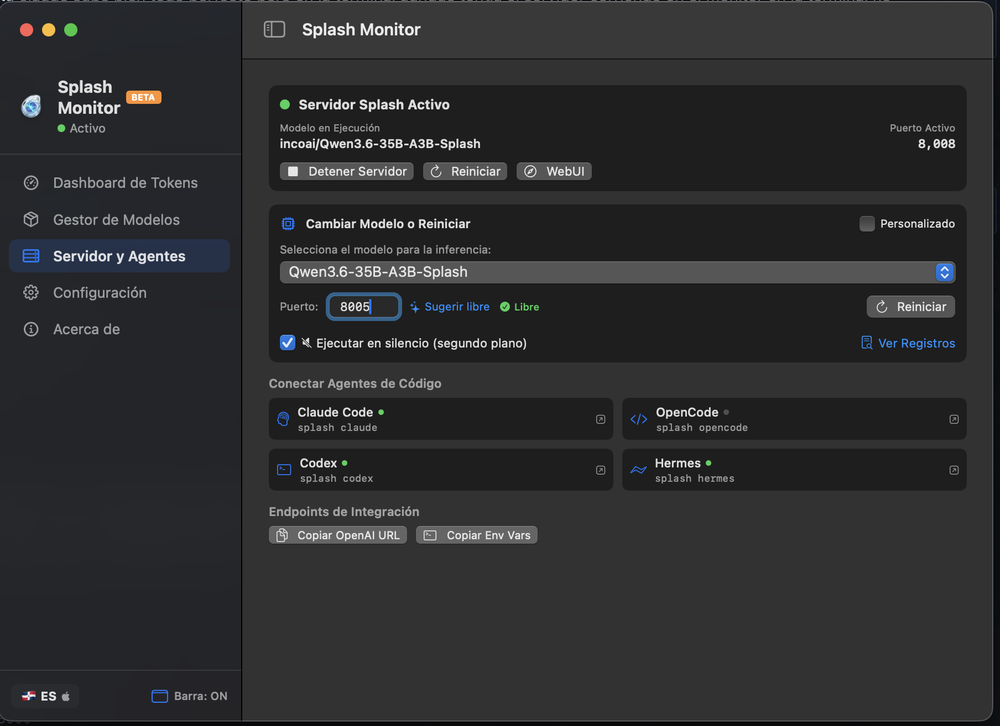
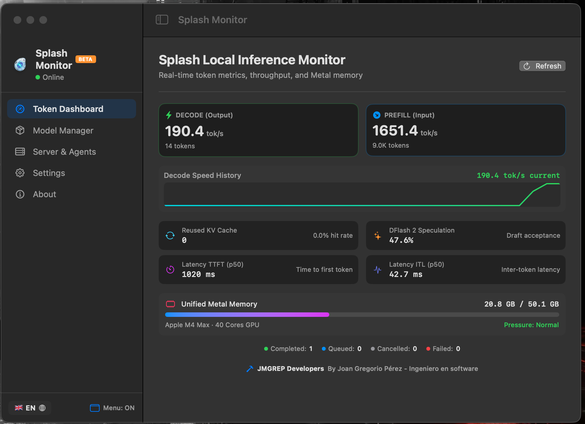

<div align="center">

<!-- Splash Monitor — Professional README -->

<a href="https://inco.ai/blog/splash/">
  
</a>

# 🌊 Splash Monitor

### The first native macOS desktop app for [Inco AI's Splash](https://inco.ai/blog/splash/) local inference engine

*El primer app de escritorio nativo de macOS para el motor de inferencia local [Splash de Inco AI](https://inco.ai/blog/splash/)*

<br/>

[](https://developer.apple.com/macos/)
[](https://www.swift.org/)
[](https://www.apple.com/silicon/)
[](https://github.com/hometrix/SplashMonitor/releases/tag/v1.0.0-beta)
[](https://github.com/hometrix/SplashMonitor/releases/download/v1.0.0-beta/SplashMonitor-1.0.0-beta.dmg)
[](LICENSE)
[](#-autor--author)

<br/>

<div align="center">
  
  <br/><br/>
  
</div>

<br/>

**[🇪🇸 Español](#-español)** &nbsp;·&nbsp; **[🇬🇧 English](#-english)**

</div>

---

<div id="-español"></div>

## 🇩🇴 Español

### ¿Por qué Splash Monitor?

Hasta ahora, [Splash](https://inco.ai/blog/splash/) solo podía operarse desde la línea de comandos. **Splash Monitor** transforma esa experiencia en una suite visual completa para macOS: monitoreo de métricas en tiempo real, gestión de modelos de Hugging Face con un solo clic, y lanzadores de agentes de código — todo desde un ícono en la barra de menú o una ventana de escritorio nativa.

---

### ✨ Características Principales

<table>
<tr>
<td width="50%" valign="top">

#### 📊 Dashboard de Métricas en Tiempo Real
- Velocidades de **prefill** y **decode** en `tok/s` con gráficas sparkline
- Monitoreo de la tasa de acierto del **KV Cache** y ahorro de tokens
- Tasa de aceptación especulativa de **DFlash 2**
- Métricas de latencia **TTFT** e **ITL** (percentil p50)

</td>
<td width="50%" valign="top">

#### 💾 Monitor de Memoria Unified Metal
- Barra de uso de memoria en tiempo real (ej. `23.7 GB / 55.6 GB`)
- Detección automática del procesador Apple Silicon y cores GPU
- Indicador de presión de memoria del sistema

</td>
</tr>
<tr>
<td width="50%" valign="top">

#### 📦 Gestor de Modelos
- Catálogo de modelos locales instalados con espacio en disco
- Explorador del catálogo en vivo de [Hugging Face](https://huggingface.co/incoai)
- Instalación de modelos con un clic y salida de terminal en vivo

</td>
<td width="50%" valign="top">

#### 🕹️ Control del Servidor
- Selector de modelo interactivo con cambio en caliente
- Iniciar / detener el servidor en un clic
- Lanzadores de agentes: **Claude Code**, **OpenCode**, **Codex**, **Hermes**
- Copia de endpoint compatible con OpenAI

</td>
</tr>
<tr>
<td width="50%" valign="top">

#### 🌐 Detección Automática de Idioma
- Sincronización dinámica con el idioma de macOS
- Cambio en tiempo real sin reiniciar la app
- Control manual: Español 🇩🇴 / English 🇬🇧

</td>
<td width="50%" valign="top">

#### 🍎 Experiencia Nativa de macOS
- **Menu bar extra** con 4 modos de visualización
- Icono 3D gota líquida con transparencia alpha completa
- `NavigationSplitView` con 5 secciones en la barra lateral
- Compatibilidad con macOS 13.0+ en Apple Silicon

</td>
</tr>
</table>

---

### 📥 Instalación

#### Requisitos Previos — Motor Splash de Inco AI

Splash Monitor es un monitor gráfico para el motor de inferencia local **[Splash](https://github.com/incoai/splash)** de Inco AI. Antes de instalar Splash Monitor, necesitas tener Splash funcionando en tu Mac.

**Instala Splash desde el repositorio oficial de Inco AI:**

```bash
# Agregar el tap oficial de Inco AI e instalar Splash
brew install incoai/tap/splash
```

> 📋 **Requisitos del motor Splash** (según [incoai/splash](https://github.com/incoai/splash)):
> - Mac con Apple Silicon **M3 o posterior**
> - **macOS 26.4** (Tahoe) o posterior
> - **36 GB** de memoria unificada (48 GB o más recomendado)
>
> Los modelos se descargan automáticamente en el primer uso. Consulta los modelos disponibles en [huggingface.co/incoai](https://huggingface.co/incoai).

Una vez que Splash esté instalado y funcionando, instala Splash Monitor:

#### Opción A — Homebrew Cask (Recomendada Oficial · Sin Alertas de Gatekeeper)

La forma nativa y recomendada en macOS. Al instalar mediante Homebrew, macOS no aplica cuarentena de navegador y la app abre de inmediato:

```bash
brew install --cask hometrix/tap/splash-monitor
```

---

#### Opción B — Instalación en 1 Línea (Terminal / Script)

La forma más rápida si no deseas usar Homebrew tap:

```bash
curl -fsSL https://raw.githubusercontent.com/hometrix/SplashMonitor/main/scripts/install.sh | bash
```

> ⚡️ Este comando descarga el DMG oficial de GitHub Releases, lo monta, copia la app a `/Applications` y la abre automáticamente.

---

#### Opción C — Descarga Manual del DMG

1. **Descarga** el instalador oficial:
   👉 [**SplashMonitor-1.0.0-beta.dmg**](https://github.com/hometrix/SplashMonitor/releases/download/v1.0.0-beta/SplashMonitor-1.0.0-beta.dmg) *(4.3 MB)*

2. Haz doble clic en el `.dmg` descargado y arrastra **Splash Monitor** a **Aplicaciones**.

> 🛡️ **Si macOS muestra: "Apple no ha podido verificar que no contenga software malicioso..."**:
> Este aviso lo impone macOS a todas las apps de código abierto sin licencia de pago de Apple. Para abrirla:
> 1. Ve a **Ajustes del Sistema** en tu Mac.
> 2. Haz clic en **Privacidad y seguridad** (en la barra lateral) y baja hasta **Seguridad**.
> 3. Pulsa el botón **"Abrir de todas formas"** (*Open Anyway*).
> 
> *O por Terminal (1 segundo):*
> ```bash
> xattr -d com.apple.quarantine ~/Downloads/SplashMonitor*.dmg
> ```

---

#### Opción B — Compilar desde Código Fuente (Desarrolladores)

**Requisitos:**

| Requisito | Versión Mínima |
|-----------|---------------|
| Mac | Apple Silicon (M3, M4, M5) |
| macOS | 13.0 o superior |
| Xcode | 15+ o Swift 6.0 Toolchain |
| Splash Engine | [incoai/tap/splash](https://github.com/incoai/splash) |

```bash
# 1. Clonar el repositorio
gh repo clone hometrix/SplashMonitor
cd SplashMonitor

# 2. Compilar la app y generar el bundle .app
./scripts/build_app.sh

# 3. (Opcional) Generar el instalador DMG comprimido
./scripts/create_dmg.sh

# 4. Iniciar la aplicación
open "Splash Monitor.app"
```

---

### 🏗️ Arquitectura del Proyecto

```
SplashMonitor/
├── Package.swift                    # Manifiesto Swift Package Manager
├── LICENSE                          # Licencia MIT
├── CONTRIBUTING.md                  # Guías de contribución (bilingüe)
├── SECURITY.md                      # Política de divulgación responsable
├── CODE_OF_CONDUCT.md               # Código de Conducta Contributor Covenant v2.1
├── README.md                        # Documentación técnica bilingüe
├── Resources/
│   ├── AppIcon.icns                 # Bundle de icono multi-resolución
│   └── AppIcon.iconset/             # Assets de icono estándar y Retina
├── scripts/
│   ├── build_app.sh                 # Build Release + empaquetado .app
│   └── create_dmg.sh                # Empaquetado DMG vía hdiutil
└── Sources/
    └── SplashMonitor/
        ├── SplashMonitorApp.swift   # Entry point (WindowGroup + MenuBarExtra)
        ├── Models/
        │   └── SplashStatus.swift   # Structs Codable para /status y HF API
        ├── Services/
        │   ├── SplashService.swift  # Singleton (polling, procesos, servidor)
        │   └── LocalizationService.swift # Detección dinámica del idioma
        └── Views/
            ├── MainWindowView.swift # NavigationSplitView de escritorio
            ├── MenuBarView.swift    # Popover interactivo del menú superior
            ├── TokenMetricsView.swift # Sparkline, tarjetas de velocidad, gauge
            ├── ModelManagerView.swift # Modelos locales + catálogo HF
            ├── ServerControlView.swift # Selector, controles, lanzadores
            ├── AboutView.swift      # Créditos e info de versión
            ├── AppIconView.swift    # Renderizado del icono de la app
            └── DominicanEmblem.swift # Emblema patrio dominicano
```

---

### 🛠️ Stack Tecnológico

| Componente | Tecnología |
|:-----------|:-----------|
| **Lenguaje** | Swift 6 |
| **UI Framework** | SwiftUI |
| **Package Manager** | Swift Package Manager |
| **Plataforma** | macOS 13.0+ (Apple Silicon) |
| **Motor de Inferencia** | [Inco AI Splash](https://inco.ai/blog/splash/) |
| **Catálogo de Modelos** | [Hugging Face API](https://huggingface.co/incoai) |
| **Icono** | Custom 3D liquid droplet (SF Symbols + Canvas) |
| **Empaquetado** | `hdiutil` (DMG nativo de macOS) |

---

### 🤝 Contribuir

¡Las contribuciones son bienvenidas! Consulta nuestras guías antes de participar:

| Documento | Descripción |
|:----------|:------------|
| 📋 [Guía de Contribución](CONTRIBUTING.md) | Flujo de trabajo, convenciones de código y estructura del proyecto |
| 🔒 [Política de Seguridad](SECURITY.md) | Divulgación responsable de vulnerabilidades |
| 📜 [Código de Conducta](CODE_OF_CONDUCT.md) | Contributor Covenant v2.1 |

---

### 👤 Autor y Créditos

<table>
<tr>
<td align="center" width="80">
  
</td>
<td>
  <b>Joan Gregorio Pérez</b><br/>
  <i>Software Engineer · JMGREP Developers</i><br/>
  🇩🇴 República Dominicana<br/>
  <a href="https://github.com/hometrix">GitHub</a>
</td>
</tr>
</table>

**Agradecimientos especiales:**
- [Inco AI](https://inco.ai/blog/splash/) — Motor de inferencia Splash
- [Hugging Face](https://huggingface.co/incoai) — Catálogo de modelos

---

### 📄 Licencia

Este proyecto está licenciado bajo la **Licencia MIT**. Consulta el archivo [LICENSE](LICENSE) para los términos completos.

```
MIT License — Copyright (c) 2026 JMGREP Developers / Joan Gregorio Pérez
```

#### Atribuciones y Licencias de Componentes

Splash Monitor es una aplicación independiente que interactúa con componentes de terceros. A continuación se detallan las licencias de cada dependencia:

| Componente | Licencia | Repositorio |
|:-----------|:---------|:------------|
| **Splash Monitor** | MIT | [hometrix/SplashMonitor](https://github.com/hometrix/SplashMonitor) |
| **Splash Engine** | Apache-2.0 | [incoai/splash](https://github.com/incoai/splash) |
| **Modelo Qwen3.8-27B-Splash** | Apache-2.0 | [incoai/Qwen3.8-27B-Splash](https://huggingface.co/incoai/Qwen3.8-27B-Splash) |
| **Modelo Qwen3.6-35B-A3B-Splash** | Apache-2.0 | [incoai/Qwen3.6-35B-A3B-Splash](https://huggingface.co/incoai/Qwen3.6-35B-A3B-Splash) |
| **Qwen3.8-27B** (base) | Apache-2.0 | [Qwen/Qwen3.8-27B](https://huggingface.co/Qwen/Qwen3.8-27B) |
| **Qwen3.6-35B-A3B** (base) | Apache-2.0 | [Qwen/Qwen3.6-35B-A3B](https://huggingface.co/Qwen/Qwen3.6-35B-A3B) |

> ⚠️ **Aviso**: Los pesos de los modelos mantienen sus propias licencias. Consulta cada repositorio en Hugging Face para los términos específicos.

> ℹ️ **Disclaimer**: Splash Monitor es un proyecto independiente y **no está afiliado, patrocinado ni respaldado por Inco AI**. "Splash" es una marca de Inco AI. Este proyecto utiliza la API pública de Splash bajo los términos de la licencia Apache-2.0.

---

<div id="-english"></div>

## 🇬🇧 English

### Why Splash Monitor?

Until now, [Splash](https://inco.ai/blog/splash/) could only be operated from the command line. **Splash Monitor** transforms that experience into a complete visual suite for macOS: real-time metrics monitoring, one-click Hugging Face model management, and code agent launchers — all from a menu bar icon or a native desktop window.

---

### ✨ Key Features

<table>
<tr>
<td width="50%" valign="top">

#### 📊 Real-Time Token Dashboard
- **Prefill** and **decode** speeds in `tok/s` with sparkline charts
- **KV Cache** hit rate monitoring and token savings tracking
- **DFlash 2** speculative acceptance rate
- **TTFT** and **ITL** latency metrics (p50 percentile)

</td>
<td width="50%" valign="top">

#### 💾 Metal Unified Memory Gauge
- Real-time memory usage bar (e.g. `23.7 GB / 55.6 GB`)
- Automatic Apple Silicon GPU core detection
- System memory pressure indicator

</td>
</tr>
<tr>
<td width="50%" valign="top">

#### 📦 Model Manager
- Local installed models catalog with disk usage
- Live [Hugging Face](https://huggingface.co/incoai) catalog explorer
- One-click model installation with live terminal output

</td>
<td width="50%" valign="top">

#### 🕹️ Server Controls
- Interactive model selector with hot-swapping
- Start / stop the server with one click
- Code agent launchers: **Claude Code**, **OpenCode**, **Codex**, **Hermes**
- One-click OpenAI-compatible API endpoint copying

</td>
</tr>
<tr>
<td width="50%" valign="top">

#### 🌐 Auto Language Detection
- Dynamic sync with macOS system language
- Real-time switching without restart
- Manual toggle: Español 🇩🇴 / English 🇬🇧

</td>
<td width="50%" valign="top">

#### 🍎 Native macOS Experience
- **Menu bar extra** with 4 display modes
- 3D liquid droplet icon with full alpha transparency
- `NavigationSplitView` with 5 sidebar sections
- macOS 13.0+ compatibility on Apple Silicon

</td>
</tr>
</table>

---

### 📥 Installation

#### Prerequisites — Inco AI Splash Engine

Splash Monitor is a graphical monitor for Inco AI's **[Splash](https://github.com/incoai/splash)** local inference engine. Before installing Splash Monitor, you need Splash running on your Mac.

**Install Splash from the official Inco AI repository:**

```bash
# Add the official Inco AI tap and install Splash
brew install incoai/tap/splash
```

> 📋 **Splash engine requirements** (from [incoai/splash](https://github.com/incoai/splash)):
> - Mac with Apple Silicon **M3 or newer**
> - **macOS 26.4** (Tahoe) or later
> - **36 GB** of unified memory (48 GB or more recommended)
>
> Models are downloaded automatically on first use. See available models at [huggingface.co/incoai](https://huggingface.co/incoai).

Once Splash is installed and running, install Splash Monitor:

#### Option A — Homebrew Cask (Recommended · Official · Zero Gatekeeper Prompts)

The native macOS package manager method. When installed through Homebrew, macOS does not flag it with browser quarantine:

```bash
brew install --cask hometrix/tap/splash-monitor
```

---

#### Option B — 1-Line Quick Install (Terminal / Script)

The quickest method without tapping:

```bash
curl -fsSL https://raw.githubusercontent.com/hometrix/SplashMonitor/main/scripts/install.sh | bash
```

> ⚡️ This script downloads the official DMG from GitHub Releases, mounts it, installs to `/Applications`, and opens the app automatically.

---

#### Option C — Manual DMG Download

1. **Download** the official installer:
   👉 [**SplashMonitor-1.0.0-beta.dmg**](https://github.com/hometrix/SplashMonitor/releases/download/v1.0.0-beta/SplashMonitor-1.0.0-beta.dmg) *(4.3 MB)*

2. Double-click the downloaded `.dmg` and drag **Splash Monitor** to **Applications**.

> 🛡️ **If macOS shows: "Apple cannot verify that this app is free of malware..."**:
> This is a standard Gatekeeper notice for independent open-source apps. To allow it:
> 1. Open **System Settings** on your Mac.
> 2. Go to **Privacy & Security** and scroll down to the **Security** section.
> 3. Click **"Open Anyway"**.
> 
> *Or via Terminal (1 second):*
> ```bash
> xattr -d com.apple.quarantine ~/Downloads/SplashMonitor*.dmg
> ```

---

#### Option B — Build from Source (Developers)

**Requirements:**

| Requirement | Minimum Version |
|-------------|----------------|
| Mac | Apple Silicon (M3, M4, M5) |
| macOS | 13.0 or later |
| Xcode | 15+ or Swift 6.0 Toolchain |
| Splash Engine | [incoai/tap/splash](https://github.com/incoai/splash) |

```bash
# 1. Clone the repository
gh repo clone hometrix/SplashMonitor
cd SplashMonitor

# 2. Build the release binary and bundle .app
./scripts/build_app.sh

# 3. (Optional) Create the compressed DMG installer
./scripts/create_dmg.sh

# 4. Launch the application
open "Splash Monitor.app"
```

---

### 🏗️ Architecture

```
SplashMonitor/
├── Package.swift                    # Swift Package Manager manifest
├── LICENSE                          # MIT License
├── CONTRIBUTING.md                  # Contribution guidelines (bilingual)
├── SECURITY.md                      # Vulnerability disclosure policy
├── CODE_OF_CONDUCT.md               # Contributor Covenant v2.1
├── README.md                        # Bilingual technical documentation
├── Resources/
│   ├── AppIcon.icns                 # Multi-resolution macOS icon bundle
│   └── AppIcon.iconset/             # Standard & Retina icon assets
├── scripts/
│   ├── build_app.sh                 # Release build + .app bundling
│   └── create_dmg.sh                # DMG packaging via hdiutil
└── Sources/
    └── SplashMonitor/
        ├── SplashMonitorApp.swift   # Entry point (WindowGroup + MenuBarExtra)
        ├── Models/
        │   └── SplashStatus.swift   # Codable structs for /status & HF API
        ├── Services/
        │   ├── SplashService.swift  # Singleton (polling, processes, server)
        │   └── LocalizationService.swift # Dynamic OS language detection
        └── Views/
            ├── MainWindowView.swift # NavigationSplitView desktop window
            ├── MenuBarView.swift    # Interactive menu bar popover
            ├── TokenMetricsView.swift # Sparkline, speed cards, memory gauge
            ├── ModelManagerView.swift # Local models + HF catalog explorer
            ├── ServerControlView.swift # Selector, controls, agent launchers
            ├── AboutView.swift      # Author credits and version info
            ├── AppIconView.swift    # App icon rendering component
            └── DominicanEmblem.swift # Dominican Republic national emblem
```

---

### 🛠️ Tech Stack

| Component | Technology |
|:----------|:-----------|
| **Language** | Swift 6 |
| **UI Framework** | SwiftUI |
| **Package Manager** | Swift Package Manager |
| **Platform** | macOS 13.0+ (Apple Silicon) |
| **Inference Engine** | [Inco AI Splash](https://inco.ai/blog/splash/) |
| **Model Catalog** | [Hugging Face API](https://huggingface.co/incoai) |
| **Icon** | Custom 3D liquid droplet (SF Symbols + Canvas) |
| **Packaging** | `hdiutil` (native macOS DMG) |

---

### 🤝 Contributing

Contributions are welcome! Please read our guidelines before participating:

| Document | Description |
|:---------|:------------|
| 📋 [Contributing Guide](CONTRIBUTING.md) | Workflow, code conventions, and project structure |
| 🔒 [Security Policy](SECURITY.md) | Responsible vulnerability disclosure |
| 📜 [Code of Conduct](CODE_OF_CONDUCT.md) | Contributor Covenant v2.1 |

---

### 👤 Author & Credits

<table>
<tr>
<td align="center" width="80">
  
</td>
<td>
  <b>Joan Gregorio Pérez</b><br/>
  <i>Software Engineer · JMGREP Developers</i><br/>
  🇩🇴 Dominican Republic<br/>
  <a href="https://github.com/hometrix">GitHub</a>
</td>
</tr>
</table>

**Special Thanks:**
- [Inco AI](https://inco.ai/blog/splash/) — Splash inference engine
- [Hugging Face](https://huggingface.co/incoai) — Model catalog

---

### 📄 License

This project is licensed under the **MIT License**. See the [LICENSE](LICENSE) file for full terms.

```
MIT License — Copyright (c) 2026 JMGREP Developers / Joan Gregorio Pérez
```

#### Attributions & Component Licenses

Splash Monitor is an independent application that interfaces with third-party components. Below are the licenses for each dependency:

| Component | License | Repository |
|:----------|:--------|:-----------|
| **Splash Monitor** | MIT | [hometrix/SplashMonitor](https://github.com/hometrix/SplashMonitor) |
| **Splash Engine** | Apache-2.0 | [incoai/splash](https://github.com/incoai/splash) |
| **Qwen3.8-27B-Splash Model** | Apache-2.0 | [incoai/Qwen3.8-27B-Splash](https://huggingface.co/incoai/Qwen3.8-27B-Splash) |
| **Qwen3.6-35B-A3B-Splash Model** | Apache-2.0 | [incoai/Qwen3.6-35B-A3B-Splash](https://huggingface.co/incoai/Qwen3.6-35B-A3B-Splash) |
| **Qwen3.8-27B** (base model) | Apache-2.0 | [Qwen/Qwen3.8-27B](https://huggingface.co/Qwen/Qwen3.8-27B) |
| **Qwen3.6-35B-A3B** (base model) | Apache-2.0 | [Qwen/Qwen3.6-35B-A3B](https://huggingface.co/Qwen/Qwen3.6-35B-A3B) |

> ⚠️ **Note**: Model weights retain their own licenses. Check each Hugging Face repository for specific terms.

> ℹ️ **Disclaimer**: Splash Monitor is an independent project and is **not affiliated with, sponsored by, or endorsed by Inco AI**. "Splash" is a trademark of Inco AI. This project interfaces with the public Splash API under the terms of the Apache-2.0 license.

---

<div align="center">

Made with ❤️ in the Dominican Republic 🇩🇴

[](https://github.com/hometrix)

</div>
